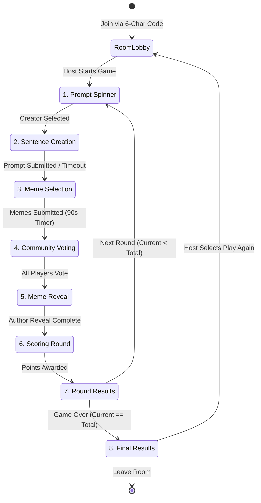
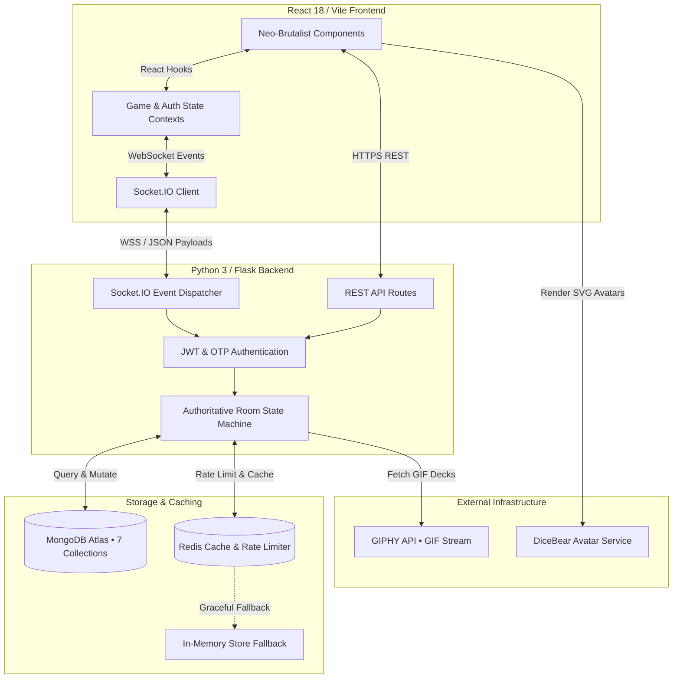

<div align="center">

# 🎭 MemeGame

### **A real-time multiplayer party game for community-ranked meme battles**

[](https://github.com)
[](https://www.python.org/)
[](https://reactjs.org/)
[](https://www.typescriptlang.org/)
[](https://socket.io/)
[](https://www.mongodb.com/)
[](https://opensource.org/licenses/MIT)

<p align="center">
  <b>Compete with friends to drop the funniest meme for every custom prompt.</b><br />
  Powered by an authoritative Python/Flask WebSocket server, React 18 with TypeScript, MongoDB Atlas, and a Neo-Brutalist design system.
</p>

[**🚀 Live Demo**](https://meme-game-six.vercel.app) • [**📖 Architecture Overview**](#-system-architecture) • [**📚 Modular Documentation**](#-documentation) • [**🛠️ Installation**](#-installation) • [**🐛 Report Bug**](https://github.com)

---

</div>

## 🌐 Overview

**MemeGame** is an online multiplayer party game designed for community-ranked meme battles. Players join a shared room, spin a roulette wheel to select a prompt creator, craft custom sentences, and submit matching meme GIFs fetched in real time from Giphy.

Rather than relying on a single subjective judge to pick winners, MemeGame features **community ranked voting** (🥇 1st place • 🥈 2nd place • 🥉 3rd place). Every player votes blindly on anonymized submissions, and round winners are determined algorithmically by point totals.

The platform is designed around two core tenets:
* **Low onboarding friction**: Players can jump into a room immediately as a guest using a 6-character room code without creating an account or verifying an email address.
* **Authoritative synchronization**: The server acts as the single source of truth for timers, game phase transitions, score validation, and reconnection state.

---

## ✨ Key Features

| Category | Highlights |
| :--- | :--- |
| **Gameplay & Rounds** | • **8-Phase Game Loop**: Structure progression from prompt selection to round scoring.<br />• **Prompt Spinner**: Automated wheel selection algorithm for rotating prompt creators.<br />• **7-Meme Hand**: Each player receives a curated hand of GIFs each round with limited tactical rerolls.<br />• **Ranked Community Voting**: Blind ranked-choice voting ensuring fair, mathematical round scoring.<br />• **Author Reveal Gallery**: Anonymous submissions unmask their creators alongside animated badge banners. |
| **Multiplayer Engine** | • **Authoritative Server**: Server-side countdown timers, phase guards, and score calculations.<br />• **Session Recovery**: Players who temporarily disconnect can rejoin their room seat with preserved score and hand.<br />• **Host Room Controls**: Room hosts can configure round limits, force-skip slow phases, and trigger rematches. |
| **Identity & Security** | • **Instant Guest Access**: Host or join rooms immediately with custom avatars and display names.<br />• **Seamless Account Migration**: Upgrading from a guest to a registered user merges match history and XP automatically.<br />• **OTP Verification**: Secure 6-digit email verification for user registration and account recovery.<br />• **IP Rate Limiting**: Token-bucket rate limiting protecting authentication endpoints. |
| **Neo-Brutalist UI** | • **Bento Grid Layouts**: High-density card layouts with distinct visual hierarchy.<br />• **Canvas Plaque Generator**: Generate and export shareable PNG match summary cards.<br />• **Tactile Micro-Interactions**: High-contrast borders, hard drop shadows, and responsive layout animations.<br />• **Accessibility**: High-contrast HSL color palettes and keyboard-navigable dialogs. |

---

## 🕹️ Game Flow

MemeGame operates as an authoritative state machine where phase transitions are driven and validated by the backend server.



1. **Room Lobby**: Players join via a 6-character room code. The host selects round counts (3–8 rounds) and initiates the match.
2. **Prompt Spinner**: An animated wheel selects the Prompt Creator for the round.
3. **Sentence Creation**: The Prompt Creator inputs a custom sentence or chooses from curated prompt decks.
4. **Meme Selection**: Players select their funniest GIF from their 7-card hand before the round timer expires.
5. **Community Voting**: Anonymized submissions are displayed. Players cast 1st, 2nd, and 3rd place votes.
6. **Meme Reveal & Scoring**: Authors are unmasked, and round-wise winners and score deltas are calculated.
7. **Round Results**: Displays the round winner card alongside updated tournament standings.
8. **Final Results**: Crowds the overall match champion and generates a shareable PNG summary card.

---

## 🏗️ System Architecture

MemeGame uses a decoupled client-server architecture with real-time bi-directional WebSocket communication.



### High-Level Components
* **Frontend Client**: Built with React 18, TypeScript, Tailwind CSS, and Framer Motion. Uses `socket.io-client` to synchronize UI state with the backend and automatically negotiate connection recovery.
* **Authoritative Server**: Python 3 backend using Flask and Flask-SocketIO. Owns room timers, phase transitions, and score calculations to prevent client-side manipulation.
* **Database & Caching Layer**: Uses MongoDB Atlas for durable storage (user accounts, rooms, sessions, OTP verification records, feedback, contact inquiries, and historical game results) and Redis for IP rate limiting and transient session caching, with automatic fallback to local memory when Redis is offline.

---

## 🎨 UI/UX Philosophy

MemeGame uses a **Neo-Brutalist** visual identity characterized by bold typography, high-contrast borders, warm pastel backgrounds, and structured Bento grid layouts.

```
┌──────────────────────────────────────────────────────────┐
│  #FFDDAB (Warm Cream Page Canvas)                        │
│  ┌────────────────────────────────────────────────────┐  │
│  │  2px Solid #131010 Border                          │  │
│  │  ┌──────────────────────────────────────────────┐  │  │
│  │  │  Bento Card Content                          │  │  │
│  │  └──────────────────────────────────────────────┘  │  │
│  │  Hard Offset Shadow (4px x 4px #131010)            │  │
│  └────────────────────────────────────────────────────┘  │
└──────────────────────────────────────────────────────────┘
```

* **Color Tokens**:
  * **Warm Cream (`#FFDDAB`)**: Primary background canvas that reduces glare while preserving contrast.
  * **Carbon Black (`#131010`)**: High-contrast color for typography, border outlines, and drop shadows.
  * **Amber Orange (`#D98324`)**: Primary accent used for primary call-to-action buttons and winner tags.
  * **Forest Green (`#5F8B4C`)**: Positive success state used for badges and winning scores.
* **Tactile Interactions**: Buttons depress physically on click, and dialogs animate smoothly using Framer Motion spring transitions.
* **Accessibility & Mobile Responsiveness**: Exceeds WCAG AAA contrast guidelines, enforces minimum 44px touch targets, supports keyboard navigation, and automatically adapts layouts across mobile and desktop viewports.

---

## 📚 Modular Documentation

To keep this introductory README readable, comprehensive engineering and API documentation is organized into modular reference guides:

* [**`docs/ARCHITECTURE.md`**](docs/ARCHITECTURE.md) — Detailed breakdown of the authoritative state machine, room synchronization, and Socket.IO event payloads.
* [**`docs/DATABASE.md`**](docs/DATABASE.md) — Document schemas, indexing strategies, and relationships across all 7 MongoDB collections.
* [**`docs/API.md`**](docs/API.md) — Complete REST API endpoint specifications, authentication headers, and request/response JSON schemas.
* [**`docs/DEPLOYMENT.md`**](docs/DEPLOYMENT.md) — Production hosting instructions for deploying the Flask backend and React frontend.
* [**`docs/CONTRIBUTING.md`**](docs/CONTRIBUTING.md) — Guidelines for reporting bugs, submitting pull requests, and adhering to code style standards.

---

## 🛠️ Technology Stack

| Layer | Technology | Description |
| :--- | :--- | :--- |
| **Frontend** | React 18, TypeScript, Vite 5, Tailwind CSS | Type-safe single-page application with utility-first styling and fast HMR. |
| **Real-Time Client** | `socket.io-client` (v4.7) | Bi-directional WebSocket client with automatic reconnection and heartbeat. |
| **Backend Server** | Python 3.10, Flask, Flask-SocketIO | Lightweight web server with eventlet-driven real-time room management. |
| **Database** | MongoDB Atlas (`pymongo`) | Document database storing user accounts, rooms, sessions, and match history. |
| **Caching & Rate Limit** | Upstash Redis (`redis-py`) | Transient caching and token-bucket IP rate limiting with in-memory fallback. |
| **External Integrations** | GIPHY API, DiceBear Avatars | GIF streaming for meme hands and SVG avatar generation for player profiles. |
| **UI & Animation** | Framer Motion, Lucide Icons, Canvas Confetti | Layout transitions, iconography, and celebration plaques. |

---

## 📂 Project Structure

```
meme-game/
├── backend/                       # Python 3 / Flask / Socket.IO Backend
│   ├── core/                      # Database connections, config, and GIPHY integration
│   ├── middleware/                # JWT authentication and guest authorization guards
│   ├── routes/                    # REST API routes and authoritative WebSocket handlers
│   ├── services/                  # SMTP email delivery, room logic, and account migration
│   ├── utils/                     # Room code generators, logging, and syntax helpers
│   ├── app.py                     # Flask application factory and CORS/Socket.IO bootstrap
│   └── requirements.txt           # Python dependency manifest
│
└── frontend/                      # React 18 / TypeScript / Vite Frontend
    ├── src/
    │   ├── components/
    │   │   ├── GamePhases/        # Isolated components for all 8 game phases
    │   │   ├── UI/                # Reusable Neo-Brutalist design system primitives
    │   │   ├── Chat.tsx           # Real-time room text chat
    │   │   └── ConnectionStatus.tsx # Live latency and reconnection indicator
    │   ├── context/               # Global authentication and WebSocket state providers
    │   ├── pages/                 # Top-level route pages (Lobby, Game, Dashboard, HowToPlay)
    │   ├── index.css              # Neo-Brutalist HSL tokens and Tailwind layer overrides
    │   └── main.tsx               # Application entry point
    └── package.json               # Node.js dependency manifest and NPM scripts
```

---

## 💻 Installation & Local Development

### Prerequisites
* **Node.js** (`v18.0+`)
* **Python** (`v3.10+`)
* **MongoDB** (Local instance or free cloud cluster via [MongoDB Atlas](https://www.mongodb.com/cloud/atlas))
* **Redis** *(Optional)*: Local instance or serverless instance via [Upstash](https://upstash.com/)

### 1. Clone the Repository
```bash
git clone https://github.com/subhash-22-codes/MemeGame.git
cd MemeGame
```

### 2. Backend Setup
```bash
cd backend

# Create and activate Python virtual environment
python -m venv venv
# On Windows:
venv\Scripts\activate
# On macOS / Linux:
source venv/bin/activate

# Install dependencies
pip install -r requirements.txt

# Create .env configuration
cp .env.example .env

# Start authoritative backend server
python app.py
```
> [!TIP]
> The backend server initializes MongoDB indexes on startup and binds Socket.IO to `http://localhost:5000`.

### 3. Frontend Setup
```bash
cd ../frontend

# Install dependencies
npm install

# Create .env configuration
cp .env.example .env

# Start Vite development server
npm run dev
```
> [!TIP]
> The React development server launches at `http://localhost:5173` with Hot Module Replacement (HMR).

---

## ⚙️ Environment Variables

### Backend Configuration (`backend/.env`)
| Variable | Required | Default | Description |
| :--- | :---: | :--- | :--- |
| `MONGODB_URI` | **Yes** | `mongodb://localhost:27017/memegame` | MongoDB connection string. |
| `JWT_SECRET_KEY` | **Yes** | `super-secret-key-change-in-prod` | Secret key for signing JWT bearer tokens. |
| `GIPHY_API_KEY` | **Yes** | `None` | API key from [Giphy Developers](https://developers.giphy.com/) for GIF fetching. |
| `REDIS_URL` | *No* | `None` | Redis URL for IP rate limiting (uses in-memory fallback if omitted). |
| `SENDER_EMAIL` | *No* | `None` | SMTP sender email address for OTP verification delivery. |
| `EMAIL_PASSWORD` | *No* | `None` | App password for `SENDER_EMAIL`. |
| `DEBUG` | *No* | `false` | Enable Flask debug mode and verbose socket logging when set to `true`. |

### Frontend Configuration (`frontend/.env`)
| Variable | Required | Default | Description |
| :--- | :---: | :--- | :--- |
| `VITE_API_URL` | **Yes** | `http://localhost:5000` | Target URL of the Flask/Socket.IO backend server. |

---

## 🗺️ Roadmap

- [x] **8-Phase Real-Time Game Loop**: Authoritative room synchronization and timers.
- [x] **Community Ranked Voting**: Blind ranked-choice scoring (`🥇 5 pts`, `🥈 3 pts`, `🥉 1 pt`).
- [x] **Guest Accounts & Migration**: Instant guest play with 1-click registered account upgrade.
- [x] **Meme of the Match Card**: Client-side Canvas generator for exportable PNG achievement plaques.
- [ ] **Custom Prompt Decks**: User-created prompt packs and themed expansion decks.
- [ ] **Voice-to-Meme Mode**: Web Speech API integration for spoken prompt creation.
- [ ] **Tournament Rooms**: Multi-table bracket support for 16–64 players.

---

## 🤝 Contributing

We welcome contributions from developers of all skill levels. Please check our [Contributing Guide](docs/CONTRIBUTING.md) for instructions on setting up your environment, running tests, and formatting pull requests.

1. Fork the repository
2. Create your feature branch (`git checkout -b feature/amazing-feature`)
3. Commit your changes (`git commit -m 'feat: add amazing feature'`)
4. Push to the branch (`git push origin feature/amazing-feature`)
5. Open a Pull Request

---

## 📄 License

Distributed under the **MIT License**. See `LICENSE` for more information.

---

## 👏 Acknowledgements

* [**Giphy Developers**](https://developers.giphy.com/) for real-time GIF streaming APIs.
* [**DiceBear Avatars**](https://www.dicebear.com/) for dynamic SVG player avatars.
* [**Lucide React**](https://lucide.dev/) for crisp, consistent UI iconography.
* [**Flask-SocketIO**](https://flask-socketio.readthedocs.io/) for Python WebSocket room infrastructure.

---

<div align="center">
  <b>Built by the MemeGame Engineering Team</b><br />
  <a href="https://meme-game-six.vercel.app">Live Demo</a> • <a href="https://github.com/subhash-22-codes/MemeGame">GitHub Repository</a>
</div>
