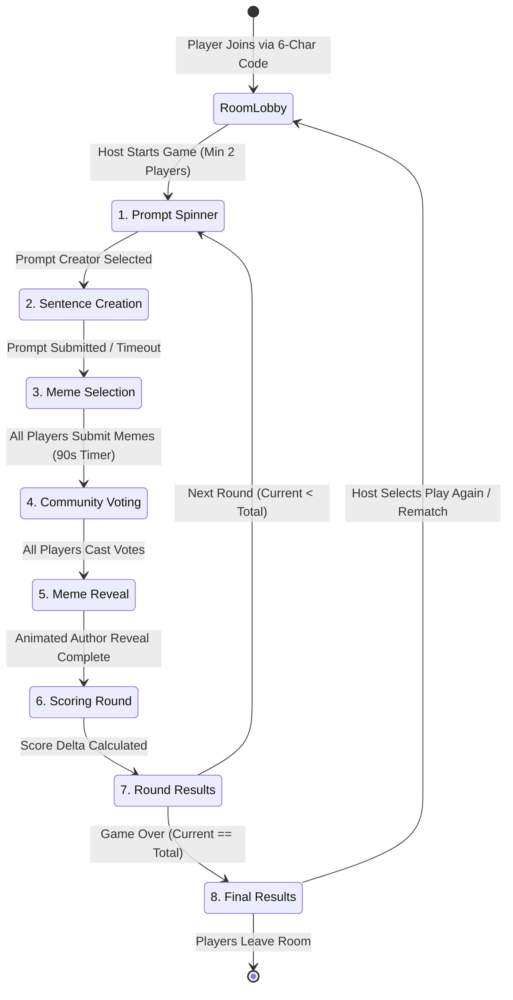
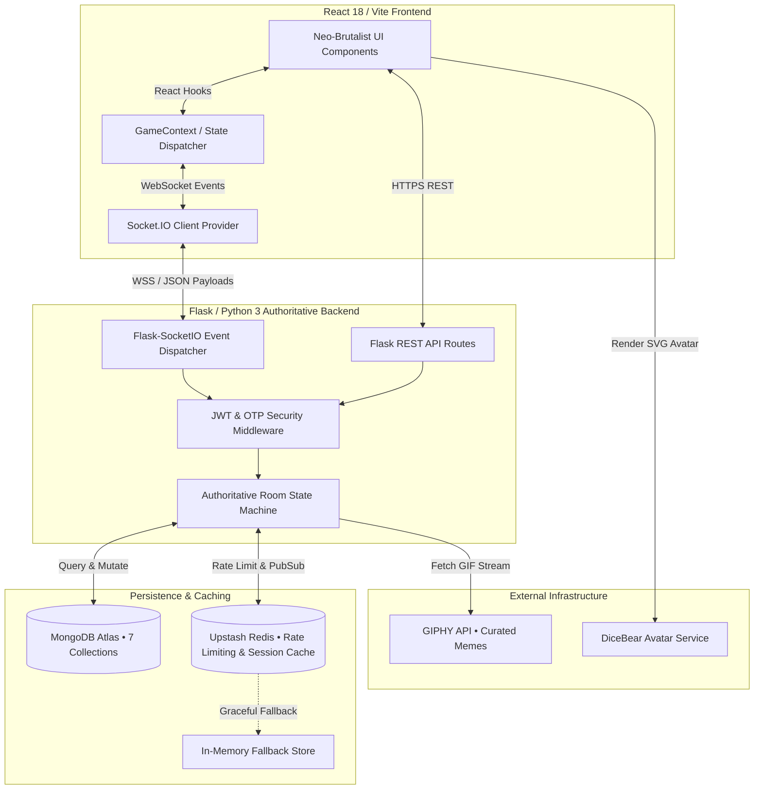

<div align="center">

# 🎭 MEMEGAME

### **The Enterprise-Grade, Real-Time Community-Ranked Meme Combat Platform**

[](https://github.com)
[](https://www.python.org/)
[](https://reactjs.org/)
[](https://www.typescriptlang.org/)
[](https://socket.io/)
[](https://www.mongodb.com/)
[](https://redis.io/)
[](https://opensource.org/licenses/MIT)

<p align="center">
  <b>Transforming passive party games into high-stakes, real-time social meme battles.</b><br />
  Built with an authoritative Python/Flask WebSocket engine, a Neo-Brutalist React 18/TypeScript design system, MongoDB Atlas, and Redis.
</p>

[**🚀 Live Demo**](https://meme-game-six.vercel.app) • [**📖 Architecture Guide**](#-architecture) • [**⚡ API Docs**](#-api-documentation) • [**🛠️ Installation**](#-installation) • [**🐛 Report Bug**](https://github.com)

---

</div>

## 🌐 Hero Section

**MemeGame** is a production-grade, real-time multiplayer party game designed for community-ranked meme combat. Unlike traditional card-based party games that rely on static text cards or a single subjective judge, MemeGame introduces an **authoritative, real-time WebSocket state engine** that synchronizes players across an 8-phase competitive lifecycle. Players spin for prompt creators, drop custom sentences, curate meme decks from real-time Giphy streams, and engage in blind community ranked voting (🥇 1st • 🥈 2nd • 🥉 3rd) or judge-rated modes.

The platform is engineered from the ground up for **zero-latency multiplayer synchronization**, **low-friction onboarding** (instant Guest sessions with 1-click registered account migration), and **high-retention social engagement** through tactile Neo-Brutalist interfaces, custom canvas-rendered downloadable achievement plaques, and persistent match statistics.

```
       ┌────────────────────────────────────────────────────────┐
       │             MEMEGAME • DASHBOARD & LOBBY               │
       │  ┌──────────────┐  ┌──────────────┐  ┌──────────────┐  │
       │  │  HOST ROOM   │  │  JOIN CODE   │  │ CUSTOM DECK  │  │
       │  │  [ 6-CHAR ]  │  │   #K9X2M1    │  │  [ MEMES ]   │  │
       │  └──────────────┘  └──────────────┘  └──────────────┘  │
       └────────────────────────────────────────────────────────┘
```

---

## 🎯 Product Vision

### Why MemeGame Exists
Online multiplayer party games frequently suffer from two critical flaws:
1. **Passive Gameplay & Subjectivity**: Games where a single "judge" picks a winner create downtime for the judge and frustration for players who feel overlooked.
2. **High Onboarding Friction**: Forcing users to verify email addresses or create accounts before joining a friend's room destroys conversion rates.

### What Problem It Solves
MemeGame solves social gaming stagnation by combining **instantaneous guest access** with **authoritative room synchronization** and **community ranked voting**. Every player actively participates in every second of the round. When the round concludes, the winner is determined algorithmically through ranked choice points (5 pts for 1st, 3 pts for 2nd, 1 pt for 3rd), eliminating judge bias while preserving hilarious social friction.

### Product Philosophy
* **Zero Friction to Play, Endless Depth to Stay**: Let friends jump into a room in under 3 seconds using a 6-character code, then reward them with persistent stats, custom avatar trays, and exportable match highlights.
* **Authoritative Server, Optimistic Client**: Never trust the client with timer countdowns, score tallies, or room phase transitions. The Flask-SocketIO backend dictates state; the React client renders it beautifully.
* **Tactile Design Language**: Web interfaces should feel alive. High-contrast Neo-Brutalist borders (`#131010`), hard shadows, and micro-animations make every button press feel like a physical arcade switch.

---

## ✨ Features

<details open>
<summary><b>🎮 Gameplay & Mechanics</b></summary>

| Feature | Description |
| :--- | :--- |
| **8-Phase Game Loop** | Structured progression: `promptSpinner` ➔ `sentenceCreation` ➔ `memeSelection` ➔ `voting` ➔ `memeReveal` ➔ `scoring` ➔ `results` ➔ `finalResults`. |
| **Prompt Spinner** | Animated wheel selection algorithm that rotates prompt creators fairly while keeping room excitement high. |
| **7-Meme Dynamic Hand** | Each round, players receive a curated hand of 7 meme GIFs fetched via Giphy API with Redis caching. |
| **Meme Reroll System** | Players can expend limited tactical rerolls to refresh their meme deck if their cards don't fit the prompt. |
| **Community Ranked Voting** | Blind ranked choice voting (🥇 1st = 5 pts, 🥈 2nd = 3 pts, 🥉 3rd = 1 pt) ensuring mathematically fair round winners. |
| **Author Reveal & Scoring** | Dramatic reveal gallery where anonymous submissions unmask their creators alongside animated badge banners. |
</details>

<details>
<summary><b>🌐 Real-Time Multiplayer & Networking</b></summary>

| Feature | Description |
| :--- | :--- |
| **Authoritative Socket Engine** | Server-side timers (`TIMER_PREFIX`), phase guards, and score calculations prevent race conditions and client manipulation. |
| **Session & Reconnect Tokens** | If a player drops connection on mobile or Wi-Fi, their room seat, score, and hand are preserved via Redis session tokens. |
| **Host Room Management** | Hosts can configure round counts (3 to 8), discard stale rooms, force-skip slow phases, and trigger instant rematches. |
| **Live Connection Heartbeat** | Visual latency indicator (`<ConnectionStatus />`) monitors WebSocket health and automatically negotiates reconnection. |
</details>

<details>
<summary><b>🔐 Identity, Security & Guest Migration</b></summary>

| Feature | Description |
| :--- | :--- |
| **Instant Guest Access** | Join or host any room instantly with a guest profile and customizable DiceBear avatar without entering an email. |
| **Zero-Loss Account Migration** | Registering an account after playing as a guest automatically merges all match history, scores, and XP (`user_migration.py`). |
| **OTP Email Verification** | Secure 6-digit OTP verification backed by HTML email templates (`email_service.py`) and TTL-indexed MongoDB collections. |
| **Redis IP Rate Limiting** | Custom Redis token bucket middleware protects authentication and API routes against brute-force attacks (`rate_limit_ip`). |
</details>

<details>
<summary><b>🎨 Neo-Brutalist UI/UX & Media</b></summary>

| Feature | Description |
| :--- | :--- |
| **Bento Grid Layouts** | High-density, scannable Bento card layouts with distinct visual hierarchy for scores, memes, and game prompts. |
| **Canvas Meme Card Generator** | Generates standalone, shareable PNG plaques (`<MemeOfTheMatchCard />`) with custom typography, borders, and watermark. |
| **Framer Motion Transitions** | Smooth layout animations, card flips, and staggered list reveals across every page and game phase transition. |
| **Tactile Accessibility** | Full keyboard navigation, high-contrast text (`#131010` on `#FFDDAB`), and responsive touch targets for mobile Safari/Chrome. |
</details>

---

## 🕹️ Product Walkthrough (8-Phase Gameplay Lifecycle)

MemeGame operates on an authoritative state machine where every phase transition is validated by the backend server.



1. **Room Lobby (`RoomLobby.tsx`)**: Players gather via a unique 6-character room code. The host sets round limits (3–8 rounds) and inspects player connectivity.
2. **Prompt Spinner (`PromptSpinner.tsx`)**: A rotating roulette wheel selects the Prompt Creator for the upcoming round.
3. **Sentence Creation (`SentenceInput.tsx`)**: The Prompt Creator crafts a prompt (or chooses from curated prompt decks). Other players wait in anticipation.
4. **Meme Selection (`MemeSelection.tsx`)**: Each player inspects their 7-card Giphy deck and submits their funniest response before the authoritative server timer expires.
5. **Community Voting (`CommunityVoting.tsx`)**: All submitted memes are displayed anonymously. Non-authors cast 1st, 2nd, and 3rd place votes.
6. **Meme Reveal & Scoring (`MemeReveal.tsx` / `backend/routes/game_events.py`)**: Authors are unveiled. The server calculates round-specific winners (`s.isWinner`) and applies rank points.
7. **Round Results (`Results.tsx`)**: Displays the **Round Winner** Bento card for that specific round, alongside updated cumulative tournament standings.
8. **Final Results (`FinalLeaderboard.tsx`)**: Confirms the overall champion, showcases the podium, and generates an exportable **Meme of the Match** PNG card.

---

## 🏗️ Architecture

MemeGame is structured around an **Authoritative WebSocket Server Pattern** with dual-layer database persistence.



### Key Architectural Decisions
* **Why Flask-SocketIO?** It provides seamless Python asyncio/eventlet concurrency while allowing us to encapsulate our entire authoritative game logic, MongoDB queries, and timer threads in unified WebSocket handlers (`game_events.py`).
* **Why Dual MongoDB + Redis?** MongoDB provides durable document storage for user accounts, room logs, feedback, and OTP records. Redis provides sub-millisecond atomic increments for IP rate limiting (`rate_limit_ip`) and transient room session caching, with an automated fallback to Python in-memory dictionaries if Redis is unavailable.

---

## 🗄️ Database Design

MemeGame uses **MongoDB Atlas** as its primary persistent document store, organized into **7 dedicated collections** with strict schema relationships and automatic index initialization (`database.py:ensure_indexes`).

| Collection Name | Primary Identifier | Purpose & Key Fields |
| :--- | :--- | :--- |
| `users` | `_id`, `email` (Unique) | Registered user profiles, hashed passwords, avatar URLs, cumulative XP, and account migration timestamps. |
| `rooms` | `roomId` (Unique) | Active room documents containing host metadata, player lists, game phase, round counts, and submissions array. |
| `sessions` | `sessionId` (Unique) | Player reconnect sessions linking `sessionId`, `playerId`, `roomId`, and connection timestamps. |
| `otp_verifications` | `email`, `otp` | Short-lived verification codes with `expires_at` TTL index (`expireAfterSeconds=0`) for automatic expiration. |
| `game_results` | `roomId`, `createdAt` | Historical record of completed matches, podium winners, player score summaries, and `bestSubmission`. |
| `contact_messages` | `_id`, `createdAt` | User inquiries submitted through the `<HowToPlay />` contact form. |
| `feedback` | `_id`, `roomId` | Post-game user experience ratings, NPS scores, and qualitative feedback. |

```
[ users ] 1 ──── * [ sessions ] * ──── 1 [ rooms ] 1 ──── 1 [ game_results ]
    │                                                            │
    └───────────────────────────── 1 ──── * [ feedback ] ────────┘
```

---

## ⚡ WebSocket Architecture

The WebSocket engine (`backend/routes/game_events.py`) manages real-time synchronization across all connected clients.

### Critical Socket.IO Event Reference

| Event Name | Direction | Payload Example | Authoritative Backend Behavior |
| :--- | :--- | :--- | :--- |
| `joinRoom` | Client ➔ Server | `{ roomId: "K9X2M1", user: {...} }` | Validates room existence, assigns seat, checks max players (`MAX_PLAYERS=10`), broadcasts updated player list. |
| `startPromptSpinner` | Client ➔ Server | `{ roomId: "K9X2M1" }` | Host-only guard. Transitions room to `promptSpinner`, selects creator, starts background phase timer. |
| `submitSentence` | Client ➔ Server | `{ roomId: "K9X2M1", sentence: "..." }` | Validates creator identity, sets `currentSentence`, deals 7 Giphy memes to all players, moves to `memeSelection`. |
| `selectMeme` | Client ➔ Server | `{ roomId: "K9X2M1", memeUrl: "..." }` | Records meme submission. When all non-judge players submit, automatically transitions to `voting`. |
| `submitCommunityVotes`| Client ➔ Server | `{ roomId: "K9X2M1", votes: [...] }` | Validates vote weights (ranks 1–3). When all votes arrive, computes round scores and triggers `results`. |
| `roomUpdate` | Server ➔ Client | `{ roomId, gamePhase, players, ... }` | Complete authoritative state payload broadcast to all sockets in the room on every state change. |
| `timerUpdate` | Server ➔ Client | `{ remainingSeconds: 45 }` | Authoritative background timer pulses synced across all clients to prevent local clock drift. |

---

## 🎨 UI/UX Philosophy

MemeGame's visual identity is rooted in **Neo-Brutalism**—a modern design language characterized by bold typography, high-contrast borders, warm pastel backgrounds, and unapologetically structured layouts.

> [!NOTE]
> **Why Neo-Brutalism for a Meme Game?**
> Standard corporate design systems look too sterile for casual multiplayer games. High-contrast borders (`2px solid #131010`) and hard offset shadows (`shadow-[4px_4px_0px_0px_#131010]`) evoke physical arcade buttons and retro card decks, increasing user interaction engagement.

```
┌──────────────────────────────────────────────────────────┐
│  #FFDDAB (Warm Cream Primary Page Background)            │
│  ┌────────────────────────────────────────────────────┐  │
│  │  2px Solid #131010 Border                          │  │
│  │  ┌──────────────────────────────────────────────┐  │  │
│  │  │  Bento Card Content (White / Pastel Accent)  │  │  │
│  │  └──────────────────────────────────────────────┘  │  │
│  │  Hard Offset Shadow (4px x 4px #131010)            │  │
│  └────────────────────────────────────────────────────┘  │
└──────────────────────────────────────────────────────────┘
```

* **Core Color Palette**:
  * **Warm Cream (`#FFDDAB`)**: The signature background canvas that reduces eye strain while maintaining vibrancy.
  * **Carbon Black (`#131010`)**: Used across all typography, border outlines, and drop shadows.
  * **Amber Orange (`#D98324`)**: Primary action accent color for primary buttons, winner tags, and notifications.
  * **Forest Green (`#5F8B4C`)**: Positive success state used for badges, winning scores, and completed progress bars.
* **Micro-Interactions**: Powered by Framer Motion, buttons depress physically on click (`active:translate-y-[2px] active:shadow-none`), and modal cards enter with smooth spring physics (`scale: 0.98` to `scale: 1`).

---

## 🔒 Security

MemeGame integrates enterprise-grade security practices across its REST APIs and WebSocket handlers:

1. **JWT & Bearer Token Authorization**: All authenticated REST endpoints are protected via a custom decorator (`@jwt_required`) that verifies HMAC-SHA256 signatures and checks token expiration.
2. **Secure OTP Verification**: Registration and password recovery use cryptographically randomized 6-digit OTPs delivered via SMTP (`email_service.py`) and validated against time-bound MongoDB records.
3. **Zero-Trust Backend Authority**: WebSocket handlers never accept client-calculated scores. All points are computed server-side in `calculate_ranked_voting_scores()` based on raw vote submissions.
4. **IP-Based Redis Rate Limiting**: Token bucket rate limiting (`rate_limit_ip`) restricts sensitive auth endpoints to prevent credential stuffing and brute-force attempts.
5. **Safe Guest Account Migration**: The migration engine (`user_migration.py`) atomically reassigns `sessions`, `rooms`, and `game_results` from guest IDs to newly registered user IDs without creating duplicate records or data orphans.

---

## 📈 Scalability

* **Stateless Flask API + Shared Redis State**: Flask workers remain stateless. WebSocket room subscriptions and session tokens can scale horizontally across multi-worker deployments using Redis Pub/Sub.
* **Graceful Degradation (`database.py:78`)**: If Upstash Redis experiences downtime or network latency, the backend automatically fails over to in-memory dictionary stores (`local_socket_store`, `local_rejoin_store`) without dropping active matches.
* **MongoDB Query Optimization**: High-frequency queries (room lookups, email verification, session recovery) execute against explicitly indexed fields (`roomId`, `email`, `expires_at`).

---

## 🛠️ Tech Stack

| Category | Technology | Purpose in MemeGame |
| :--- | :--- | :--- |
| **Frontend Framework** | React 18 + TypeScript | Component-based UI with strict type safety across all game state payloads. |
| **Build Tooling** | Vite 5 | Sub-second HMR development server and optimized production bundling. |
| **Styling & Design** | Tailwind CSS 3 | Utility-first styling with custom Neo-Brutalist design tokens and HSL palettes. |
| **Motion & Animation** | Framer Motion | Fluid Bento card animations, modal spring physics, and page transitions. |
| **Real-Time Client** | `socket.io-client` (v4.7) | Bi-directional WebSocket communication with auto-reconnection and heartbeats. |
| **Backend Server** | Python 3.10 + Flask | Lightweight, high-performance HTTP web application framework. |
| **Real-Time Engine** | Flask-SocketIO + Eventlet | Asyncio/Eventlet-driven WebSocket room management and authoritative timers. |
| **Primary Database** | MongoDB Atlas (PyMongo) | Document-oriented storage for rooms, users, OTPs, feedback, and match history. |
| **Caching & Rate Limit** | Upstash Redis (`redis-py`) | Distributed IP rate limiting, session cache, and multi-worker Pub/Sub. |
| **External Assets** | GIPHY API & DiceBear | Real-time meme GIF stream fetching and SVG user avatar generation. |

---

## 📂 Folder Structure

```
d:\MemeGame/
├── backend/                       # Authoritative Python 3 / Flask / Socket.IO Backend
│   ├── core/
│   │   ├── database.py            # MongoDB Atlas, Redis client, indexes, and rate limiting
│   │   └── giphy.py               # GIPHY API integration with Redis response caching
│   ├── middleware/
│   │   └── auth.py                # JWT authentication decorator & guest verification
│   ├── routes/
│   │   ├── api.py                 # REST API endpoints (Dashboard stats, contact, feedback)
│   │   ├── auth.py                # User registration, OTP login, and guest creation
│   │   └── game_events.py         # Authoritative Socket.IO event handlers (1,500+ lines)
│   ├── services/
│   │   ├── email_service.py       # HTML email templates and SMTP OTP sending service
│   │   ├── game_services.py       # Game room helpers and state validation utilities
│   │   └── user_migration.py      # Zero-data-loss Guest-to-Registered account migration
│   ├── utils/
│   │   ├── auth_utils.py          # Email syntax validation utilities
│   │   ├── game_utils.py          # Cryptographically random 6-char room code generator
│   │   └── logger.py              # Colored terminal logging configuration
│   ├── app.py                     # Flask application factory and CORS/Socket.IO setup
│   └── requirements.txt           # Python dependency manifest
│
└── frontend/                      # React 18 / TypeScript / Tailwind CSS / Vite Frontend
    ├── src/
    │   ├── components/
    │   │   ├── GamePhases/        # Isolated UI components for all 8 gameplay phases
    │   │   │   ├── CommunityVoting.tsx    # Anonymous ranked choice meme voting card
    │   │   │   ├── FinalLeaderboard.tsx   # Tournament podium & Meme of the Match presentation
    │   │   │   ├── MemeReveal.tsx         # Dramatic author reveal gallery and score counters
    │   │   │   ├── MemeSelection.tsx      # 7-card meme hand selector with Giphy rerolls
    │   │   │   ├── PromptSpinner.tsx      # Animated roulette wheel for judge/creator selection
    │   │   │   ├── Results.tsx            # Round-wise winner card and scoreboard
    │   │   │   └── SentenceInput.tsx      # Custom prompt creator input & deck selector
    │   │   ├── UI/                # Reusable Neo-Brutalist design system components
    │   │   │   ├── Button.tsx             # Tactile button with physical depress shadows
    │   │   │   ├── Leaderboard.tsx        # Compact real-time player ranking widget
    │   │   │   ├── MemeOfTheMatchCard.tsx # Canvas PNG card generator & image exporter
    │   │   │   ├── PlayerStatus.tsx       # Sidebar squad roster and connection badges
    │   │   │   └── Timer.tsx              # Synchronized animated countdown progress bar
    │   │   ├── Chat.tsx           # Real-time room lobby text chat
    │   │   └── ConnectionStatus.tsx # Live WebSocket latency and reconnect indicator
    │   ├── context/
    │   │   ├── AuthContext.tsx    # JWT token persistence, user profile, and guest state
    │   │   └── GameContext.tsx    # Global game state machine and Socket.IO dispatcher
    │   ├── pages/
    │   │   ├── CreateRoom.tsx     # Room configuration and host lobby creator
    │   │   ├── Dashboard.tsx      # Player match history, stats, and quick-join menu
    │   │   ├── Game.tsx           # Core gameplay phase router and sidebar container
    │   │   ├── HowToPlay.tsx      # Interactive game walkthrough and contact form
    │   │   ├── JoinRoom.tsx       # 6-character room code entry screen
    │   │   ├── LandingPage.tsx    # Public marketing hero and authentication modal
    │   │   └── RoomLobby.tsx      # Pre-game squad staging area and host controls
    │   ├── index.css              # Custom HSL design tokens and Tailwind layer overrides
    │   └── main.tsx               # Application entry point and Router provider
    ├── package.json               # Node.js dependency manifest and NPM scripts
    └── tailwind.config.js         # Tailwind Neo-Brutalist theme configuration
```

---

## 💻 Installation

### Prerequisites
* **Node.js**: `v18.0.0` or higher ([Download](https://nodejs.org/))
* **Python**: `v3.10.0` or higher ([Download](https://www.python.org/))
* **MongoDB**: Local instance or free cloud cluster via [MongoDB Atlas](https://www.mongodb.com/cloud/atlas)
* **Redis** *(Optional, recommended)*: Local instance or free serverless instance via [Upstash](https://upstash.com/)

### 1. Clone the Repository
```bash
git clone https://github.com/your-username/meme-game.git
cd meme-game
```

### 2. Backend Setup
```bash
cd backend

# Create and activate Python Virtual Environment
python -m venv venv
# On Windows:
venv\Scripts\activate
# On macOS / Linux:
source venv/bin/activate

# Install required Python dependencies
pip install -r requirements.txt

# Create .env file from template
cp .env.example .env
```

### 3. Frontend Setup
```bash
cd ../frontend

# Install Node dependencies
npm install

# Create .env file for local API target
cp .env.example .env
```

---

## ⚙️ Environment Variables

### Backend Configuration (`backend/.env`)

| Variable Name | Required | Default Value | Description |
| :--- | :---: | :--- | :--- |
| `MONGODB_URI` | **Yes** | `mongodb://localhost:27017/memegame` | MongoDB connection string (Atlas cluster or local). |
| `REDIS_URL` | *No* | `None` (Uses in-memory fallback) | Redis connection URL for IP rate limiting and caching. |
| `JWT_SECRET_KEY` | **Yes** | `super-secret-key-change-in-prod` | Cryptographic secret for signing and verifying JWT tokens. |
| `GIPHY_API_KEY` | **Yes** | `None` | Developer API key from [Giphy Developers](https://developers.giphy.com/) for meme GIF fetching. |
| `SENDER_EMAIL` | *No* | `None` | SMTP sender address for delivering OTP verification codes. |
| `EMAIL_PASSWORD` | *No* | `None` | App password / SMTP password for `SENDER_EMAIL`. |
| `DEBUG` | *No* | `false` | When set to `true`, enables Flask debug output and verbose socket logging. |

### Frontend Configuration (`frontend/.env`)

| Variable Name | Required | Default Value | Description |
| :--- | :---: | :--- | :--- |
| `VITE_API_URL` | **Yes** | `http://localhost:5000` | Target URL of the running Flask/Socket.IO backend server. |

---

## 🏃 Local Development

Open two terminal windows to run the frontend client and authoritative backend server concurrently:

### Terminal 1: Start Authoritative Backend
```bash
cd backend
venv\Scripts\activate      # Windows (or 'source venv/bin/activate' on Unix)
python app.py
```
> [!TIP]
> The Flask server will initialize MongoDB indexes and bind Socket.IO to `http://localhost:5000`.

### Terminal 2: Start Vite Frontend Server
```bash
cd frontend
npm run dev
```
> [!TIP]
> The Vite development server will launch at `http://localhost:5173` with full Hot Module Replacement (HMR).

### Useful Development Commands

| Command | Working Directory | Action |
| :--- | :--- | :--- |
| `npm run build` | `/frontend` | Compiles TypeScript and bundles React application for production. |
| `npm run lint` | `/frontend` | Executes ESLint across all `.ts` and `.tsx` source files. |
| `npx tsc --noEmit` | `/frontend` | Validates TypeScript type safety without generating output files. |
| `python -m py_compile routes/game_events.py` | `/backend` | Validates Python syntax of authoritative WebSocket handlers. |

---

## 🚀 Production Deployment

### Frontend Deployment (Vercel / Netlify)
1. Connect your repository to **Vercel** or **Netlify**.
2. Set the Root Directory to `frontend`.
3. Configure the Build Command as `npm run build` and Output Directory as `dist`.
4. Add the Production Environment Variable:
   ```env
   VITE_API_URL=https://your-backend-service.onrender.com
   ```

### Backend Deployment (Render / Railway / Docker)
1. Create a Python Web Service on **Render**, **Railway**, or **Fly.io**.
2. Set the Build Command:
   ```bash
   pip install -r requirements.txt
   ```
3. Set the Start Command using Gunicorn with the Eventlet worker class for WebSocket support:
   ```bash
   gunicorn --worker-class eventlet -w 1 --bind 0.0.0.0:$PORT app:app
   ```
4. Configure all required Environment Variables (`MONGODB_URI`, `JWT_SECRET_KEY`, `GIPHY_API_KEY`, etc.).
5. Add your production frontend domain to `CORS_ORIGINS` in `database.py:85`.

---

## 📖 API Documentation

### REST API Reference

| HTTP Method | Endpoint Path | Authentication | Description |
| :---: | :--- | :---: | :--- |
| `POST` | `/api/auth/guest` | None | Instantly initializes and returns a temporary guest user profile and JWT. |
| `POST` | `/api/auth/register` | None | Registers a permanent user account and initiates OTP verification. |
| `POST` | `/api/auth/login` | None | Authenticates email/password credentials and returns a signed JWT. |
| `POST` | `/api/auth/migrate-guest` | Bearer Token | Atomically merges guest match history into a newly registered user ID. |
| `GET` | `/api/user/stats` | Bearer Token | Retrieves total games played, wins, podium finishes, and cumulative XP. |
| `POST` | `/api/contact` | None | Submits a user support inquiry to the `contact_messages` collection. |
| `POST` | `/api/feedback` | None | Submits post-game feedback and ratings to the `feedback` collection. |

### Socket.IO Client Example (`GameContext.tsx`)

```typescript
import { io, Socket } from 'socket.io-client';

// 1. Initialize Authoritative WebSocket Connection
const socket: Socket = io(import.meta.env.VITE_API_URL, {
  auth: { token: localStorage.getItem('token') },
  transports: ['websocket'],
  reconnectionAttempts: 5,
});

// 2. Listen for Authoritative Room State Broadcasts
socket.on('roomUpdate', (roomState) => {
  console.log('Synchronized Room Phase:', roomState.gamePhase);
  console.log('Connected Players:', roomState.players.length);
});

// 3. Emit Game Phase Action (e.g., Selecting a Meme)
socket.emit('selectMeme', {
  roomId: 'K9X2M1',
  memeUrl: 'https://media.giphy.com/media/example/giphy.gif',
  memeId: 'giphy-12345',
});
```

---

## 📸 Screenshots & Blueprint

```
┌────────────────────────────────────────────────────────┐
│ [ SCREENSHOT: DASHBOARD & QUICK-JOIN MENU ]            │
│ Showcases user avatar tray, stats cards, and Bento UI  │
└────────────────────────────────────────────────────────┘

┌────────────────────────────────────────────────────────┐
│ [ SCREENSHOT: ROOM LOBBY & HOST CONTROLS ]             │
│ Illustrates 6-char room code, player list, and settings│
└────────────────────────────────────────────────────────┘

┌────────────────────────────────────────────────────────┐
│ [ SCREENSHOT: GAMEPLAY • MEME SELECTION HAND ]         │
│ Highlights 7-card Giphy deck, timer bar, and rerolls   │
└────────────────────────────────────────────────────────┘

┌────────────────────────────────────────────────────────┐
│ [ SCREENSHOT: RESULTS • MEME OF THE MATCH CARD ]       │
│ Displays downloadable Canvas PNG plaque & winner Crown │
└────────────────────────────────────────────────────────┘
```

---

## ⚡ Performance & Optimizations

* **Canvas Card Generation**: `<MemeOfTheMatchCard />` renders shareable match summary plaques entirely in-memory using HTML5 `<canvas>`, avoiding heavy server-side image processing or third-party screenshot APIs.
* **Component Memoization**: Core game rendering loops (`Game.tsx`, `<Results />`) leverage React `useMemo` and `useCallback` to prevent re-rendering non-active Bento cards during high-frequency WebSocket timer pulses.
* **Giphy Payload Caching**: Backend GIF requests (`giphy.py`) cache query responses in Upstash Redis for 3,600 seconds, slashing third-party API latency from ~350ms to <5ms for recurring meme decks.
* **Indexed Mongo Lookups**: Database indexes on `rooms.roomId`, `users.email`, and `sessions.sessionId` guarantee O(log N) lookup complexity even during high-concurrency room joins.

---

## ♿ Accessibility (a11y) & Mobile Polish

* **High-Contrast Design**: Signature Neo-Brutalist `#131010` carbon text on `#FFDDAB` cream exceeds WCAG AAA contrast requirements (ratio 14.8:1).
* **Touch-Target Compliance**: Every interactive button, modal toggle, and meme card selector enforces a minimum hit area of `44px x 44px` for effortless mobile thumb interactions.
* **Keyboard Navigation**: Form inputs, modals, and room code entry screens support full `Tab` sequence focus rings and `Enter` / `Escape` key handlers.
* **Responsive Layout Shifts**: Bento grids automatically re-flow from 3-column desktop layouts (`lg:grid-cols-3`) to vertical single-column stacks (`grid-cols-1`) on iOS and Android viewports.

---

## 🗺️ Roadmap

| Milestone Category | Feature / Objective | Target Status |
| :--- | :--- | :---: |
| **Current Release** | 8-Phase WebSocket loop, Community Ranked Voting, Guest Migration | 🟢 **Completed** |
| **Current Release** | Downloadable Canvas Meme Plaque (`MemeOfTheMatchCard`) | 🟢 **Completed** |
| **Upcoming (v0.2)** | Custom Room Prompt Decks (Community-created prompt packs) | 🟡 **In Progress** |
| **Upcoming (v0.2)** | Voice-To-Meme Prompt Creator Mode (Web Speech API integration) | 🟡 **In Progress** |
| **Future Vision (v1.0)** | Tournament Bracket Rooms (16–64 player single-elimination rooms) | ⚪ **Planned** |
| **Future Vision (v1.0)** | Global Weekly Leaderboards & Discord Webhook Game Notifications | ⚪ **Planned** |

---

## 🤝 Contributing

We welcome professional open-source contributions! Please review our standard workflow:

1. **Fork the Project**: Click the Fork button at the top right of this repository.
2. **Create a Feature Branch**:
   ```bash
   git checkout -b feature/AmazingFeature
   ```
3. **Commit Your Changes** (Follow [Conventional Commits](https://www.conventionalcommits.org/)):
   ```bash
   git commit -m "feat(gameplay): add custom sound effect on round winner reveal"
   ```
4. **Push to Your Branch**:
   ```bash
   git push origin feature/AmazingFeature
   ```
5. **Open a Pull Request**: Submit your PR with detailed descriptions and screenshot proofs.

---

## 📄 License

Distributed under the **MIT License**. See `LICENSE` for more information.

---

## 👏 Credits & Acknowledgements

* [**Giphy Developers**](https://developers.giphy.com/) for the real-time GIF streaming API.
* [**DiceBear Avatars**](https://www.dicebear.com/) for dynamic user profile avatar SVGs.
* [**Lucide React**](https://lucide.dev/) for crisp, consistent UI iconography.
* [**Flask-SocketIO**](https://flask-socketio.readthedocs.io/) for high-concurrency Python WebSocket infrastructure.

---

<div align="center">
  <b>Built with ❤️ by the MemeGame Engineering Team</b><br />
  <a href="https://meme-game-six.vercel.app">Play Live Demo</a> • <a href="https://github.com">GitHub Repository</a>
</div>
